# Dockerize a project

## Overview

In this project I'll be containerizing an application (build), pushing it to a remote repository (ship), and then running the containerized application (run)

* Installing the prerequisite apps (Docker Desktop)
* Cloning a github repo containing a web app
* Creating a Dockerfile
* Building the Docker image
* Creating a public repo on Docker Hub to push/ship the image to
* Pushing the container image to a remote repo
* Pulling the container image to a separate developer environment
* Running the docker container

## Details

Install Docker Desktop and sign in

Clone a GitHub repository containing an application

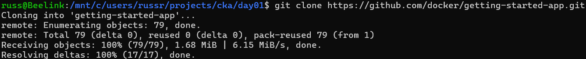

Ran 'ls' to check the name of the directory that got downloaded, ('getting-started-app') and 'cd' into the 'getting-started-app' directory.

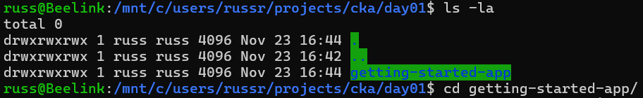

Ran 'ls -lrt' to see what files exist in the 'getting-started-app' directory.

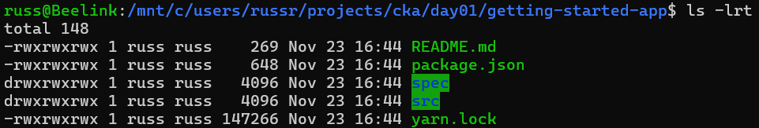

Creating the Dockerfile

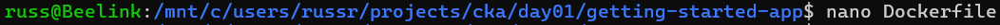

Populated the Dockerfile with the details required to build the container image.

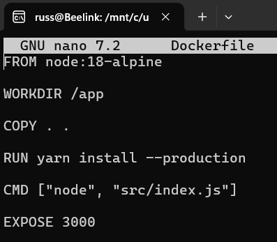

Built the Docker container image

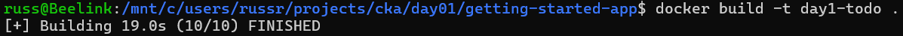

Create a public repository on the Docker Hub web page

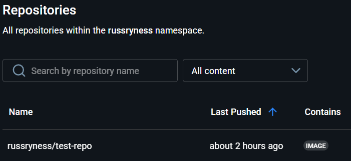

Ran 'docker tag' to tag the local image with the name of my remote Docker Hub respository.

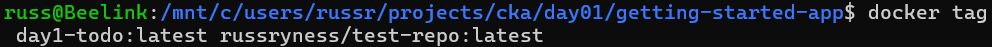

Ran 'docker login' to authenticate the CLI to Docker Hub.

Ran 'docker push' to push the container image to the remote Docker Hub repository.

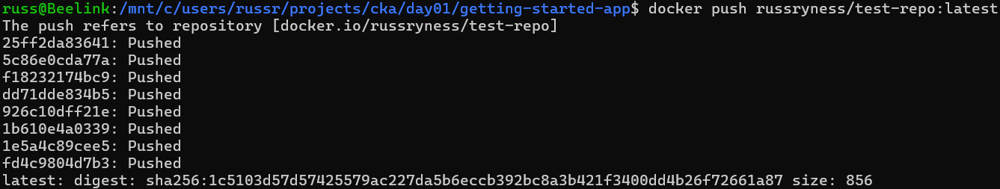

To simulate pulling the container from the remote registry to a development environment such as Dev, Test, or Prod, I decided that rather that pulling the container to my system, (which already had the container) I decided to try out the 'Play with Docker' environment.

I signed into 'Play with Docker' and it loaded a new test instance, and I pulled the container from the remote registry to the test instance.

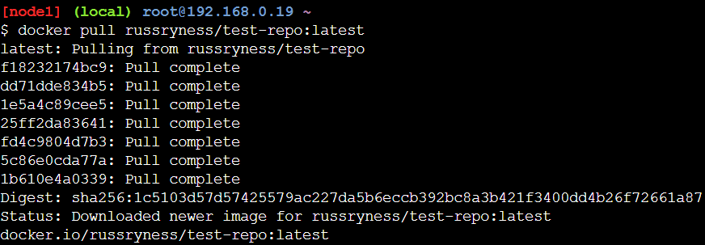

Ran 'docker images' to list the images.

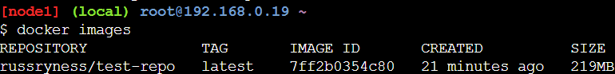

Ran the application.

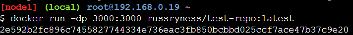

Ran 'docker ps' and confirmed the container was running.

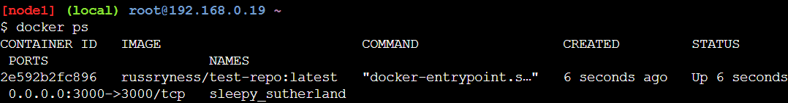

Confirmed that the web app is functioning properly on port 3000. In the 'Play with Docker' test environment you click the 'open port' button and enter the desired port number, and then it opens a new tab with the test instance IP and that port. Very cool.

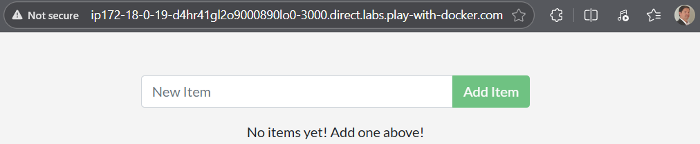

## Cleanup

Cleaning up for this project involved stopping the container...

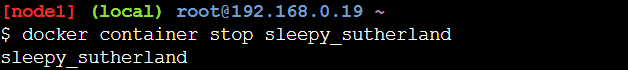

Confirming the container had exited...

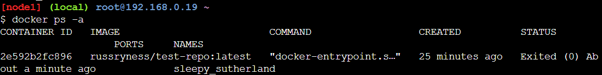

And then removing the container...

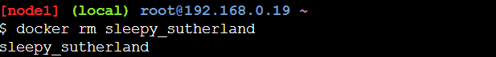

Confirming the container has been deleted.

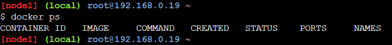

I could also have force stopped and removed the container all at once using 'docker rm -f container_name' but I preferred to observe exactly what is taking place after running the above commands, for the time being.

## Final Thoughts

This was a great refresher on Docker and the overall process of building a container image, pushing it to a remote repository, and then pulling the container image down to a desired development environment.

## Acknowledgements

This is the first lab in Piyush Sachdeva's Certified Kubernetes Course. Props to Piyush!

YouTube: https://www.youtube.com/playlist?list=PLl4APkPHzsUUOkOv3i62UidrLmSB8DcGC

GitHub: https://github.com/piyushsachdeva/CKA-2024