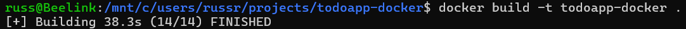
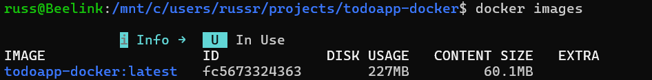
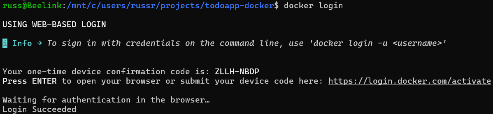
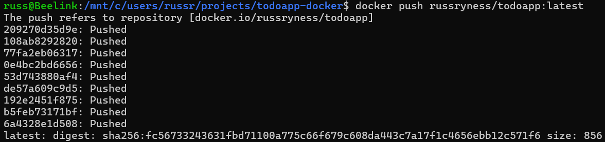
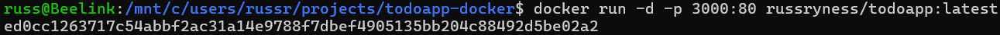
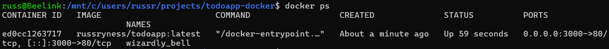
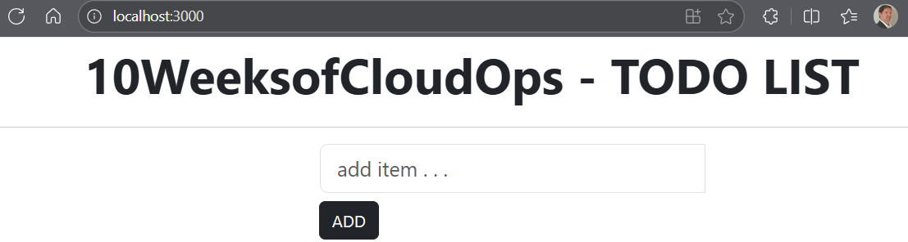
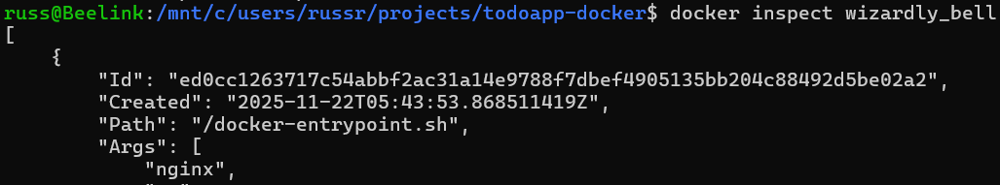
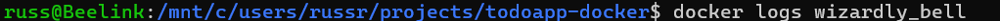
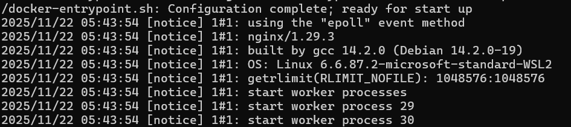

# Multi Stage Docker Build

## Overview

In this project I'll be setting up a multi stage docker build:

* Cloning a github repo containing a web app
* Creating a Dockerfile
* Building the Docker image
* Creating a public repo on Docker Hub to ship the image to
* Running the docker container
* Testing some administrative actions in the container using the 'docker logs', 'docker inspect' commands

## Details

Used the 'git clone' command to download a webapp from GitHub.

Next, I cd'ed into the web app directory, and created a Dockerfile, and populated the Dockerfile with the relevant details to use an Alpine linux image & install nginx.

With the Dockerfile populated, I next ran 'docker build' to build the docker image using the application code and the Dockerfile.

After that I verified that the image had been successfully created using the 'docker images' command.

Next, I signed into Docker Hub (https://hub.docker.com) and created a new public repository (russryness/todoapp).

Then, from the PowerShell command line, I signed into docker, tagged the local container with the name of my remote repository, and pushed it to my 'russryness/todoapp' repository.

I ran the container on my localsystem by issueing the 'docker run' command to redirect the localhost port 3000 to port 80

I confirmed that the container was running successfully using the 'docker ps' command...

...and by accessing the web app in a web browser at http://localhost:3000 

With the container up and running, I experimented with some docker commands to perform some standard admin-rype duties, such as inspecting the container details, viewing the container logs, etc.

## Cleanup

Cleaning up for this project involved stopping the container...

Confirming the container had exited...

And then removing the container...

Confirming the container has been deleted.

I could also have force stopped and removed the container all at once using 'docker rm -f container_name' but I preferred to observe exactly what is taking place after running the above commands, for the time being.

## Final Thoughts

This was a simple, strait-forward lab to re-familiarize myself with Docker and the BUILD, SHIP, RUN process it uses. I'll be using Docker a lot more in additional labs as I continue to learn Docker and Kubernetes.

## Acknowledgements

This is the second lab in Piyush Sachdeva's Certified Kubernetes Course. Props to Piyush!

YouTube: https://www.youtube.com/playlist?list=PLl4APkPHzsUUOkOv3i62UidrLmSB8DcGC

GitHub: https://github.com/piyushsachdeva/CKA-2024